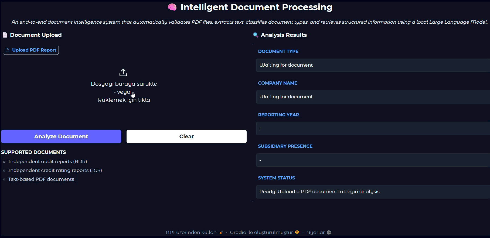

# 🧠 Yerel LLM ile Akıllı Belge İşleme (Intelligent Document Processing)

Bu proje; **BDR ve JCR raporları gibi finansal PDF dosyalarını** otomatik olarak doğrulayan, metin çıkaran, belge türlerini sınıflandıran ve yerel bir Büyük Dil Modeli (LLM) kullanarak yapılandırılmış bilgileri çıkaran uçtan uca bir belge zekası sistemidir.

---

## 🚀 Genel Bakış

Bu proje, Python ile geliştirilmiş **Yapay Zeka Destekli Belge Zekası** uygulamasıdır. BDR ve JCR raporları gibi finansal PDF raporlarını eksiksiz bir analiz boru hattından (pipeline) geçirerek bulut tabanlı AI servislerine ihtiyaç duymadan anlamlı ve yapılandırılmış bilgiler çıkarır.

Sistem; hızlı, gizlilik odaklı ve yapılandırılmış belge analizi sağlamak için **kural tabanlı belge sınıflandırmasını**, yerel olarak barındırılan bir Büyük Dil Modeli (**Qwen2.5-1.5B-Instruct**) ile birleştirir.

---

## ✨ Temel Özellikler

* **PDF Doğrulama ve Temizleme:** Girdi belgelerini otomatik olarak doğrular ve temizler.
* **Akıllı Sınıflandırma:** Kural tabanlı belge türü sınıflandırması yapar.
* **Yerel LLM ile Bilgi Çıkarımı:** Güvenli veri elde etme süreci için yerel Qwen2.5 modeliyle güçlendirilmiştir.
* **Yapılandırılmış Veri Çıktısı:** Şirket adlarını, raporlama yıllarını ve bağlı ortaklık durumunu JSON ve Excel formatlarında kaydeder.
* **İnteraktif Arayüz:** Modern Gradio tabanlı web arayüzüne sahiptir.
* **%100 Yerel Çalışma:** Harici bir API bağımlılığı olmaksızın tamamen kendi bilgisayarınızda çalışır.

---

| Kategori | Teknolojiler |
| :--- | :--- |
| **Dil** | Python |
| **Yapay Zeka Modeli** | Qwen2.5-1.5B-Instruct |
| **Çatılar (Frameworks)** | Hugging Face Transformers, Gradio |
| **Veri İşleme** | Pandas, PyPDF / PDF kütüphaneleri |

---

## 🚀 Hızlı Başlangıç

Projeyi kendi bilgisayarınızda çalıştırmak için terminalinizde şu adımları takip edin:

```bash
# Repoyu klonlayın
git clone [https://github.com/ilaydaylcnz/Intelligent_Document_Processing_with_Local_LLMs.git](https://github.com/ilaydaylcnz/Intelligent_Document_Processing_with_Local_LLMs.git)

# Proje dizinine girin
cd Intelligent_Document_Processing_with_Local_LLMs

# Gerekli kütüphaneleri yükleyin
pip install -r requirements.txt

# Uygulamayı başlatın
python app.py
